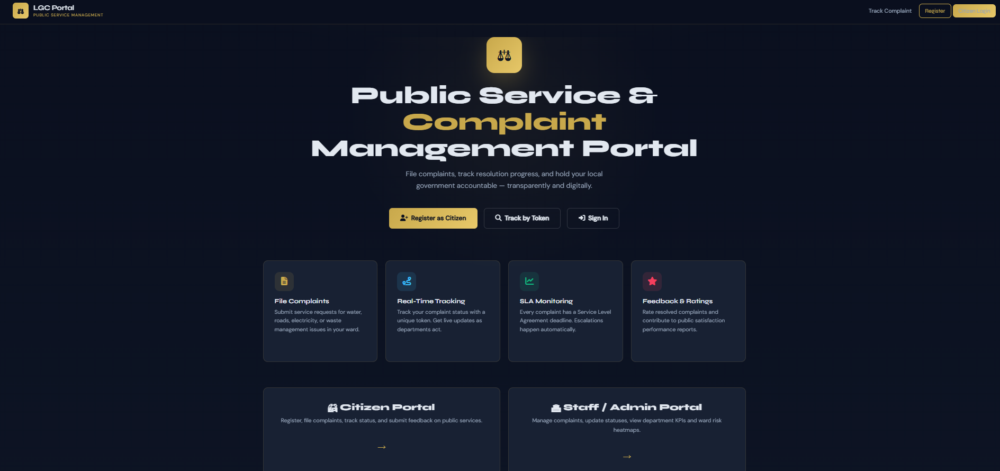
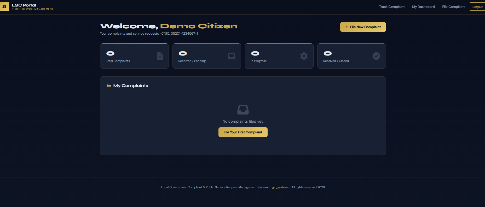
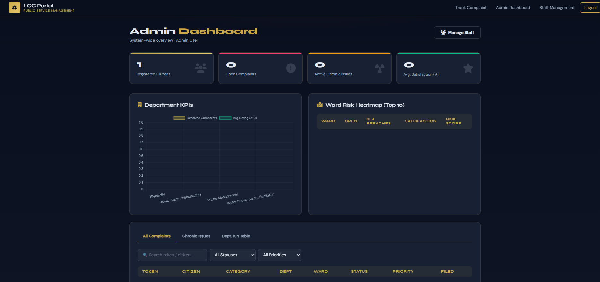
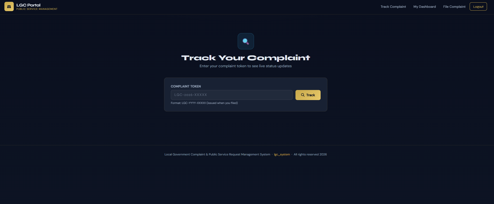

# LGC System — Local Government Complaint Management System


A full-stack web app that lets citizens file and track complaints about civic issues — water supply, road damage, electricity, sanitation — while staff resolve them and admins keep an eye on department performance through automated analytics and dashboards.

It's a database-driven Flask app backed by MySQL, with SQL views doing most of the reporting work under the hood instead of Python-side aggregation.

---

## Live Demo

[](https://web-production-0512c.up.railway.app)

**[web-production-0512c.up.railway.app](https://web-production-0512c.up.railway.app)**

Log in with any of these to poke around:

| Role | Email | Password |
|---|---|---|
| Citizen | `citizen@demo.com` | `demo123` |
| Staff | `staff@demo.com` | `demo123` |
| Admin | `admin@demo.com` | `admin123` |

---

## Features

- **Role-based access** — separate login flows and dashboards for Citizens, Staff, and Admins
- **Complaint management** — citizens file complaints against a category/department, track status, and leave feedback once resolved
- **Public complaint tracking** — anyone can track a complaint by its token, no login needed
- **SLA tracking** — every complaint gets a deadline based on its category, and breaches get tracked automatically
- **Admin dashboards** — department KPIs, a ward-level risk heatmap, chronic/recurring issue detection, citizen satisfaction ratings
- **Chart.js visualizations** — complaint status breakdown, department performance, and ward risk, all on the admin dashboard
- **Staff management** — admins can add, deactivate, and reactivate staff accounts
- **Automated SQL logic** — recurring complaints in the same ward/category get auto-flagged as chronic issues; resolving a complaint auto-prompts the citizen for feedback

---

## Tech Stack

| Layer | Technology |
|---|---|
| Backend | Flask (Python) |
| Database | MySQL |
| Frontend | HTML, CSS, JavaScript |
| Charts | Chart.js |
| Auth | Werkzeug password hashing |
| Deployment | Gunicorn + Railway |

---

## How to Run Locally

**1. Clone the repository**
```bash
git clone https://github.com/umarzia-git/Local-Government-Complaint-Public-Service-Request-Management-System.git
cd Local-Government-Complaint-Public-Service-Request-Management-System
```

**2. Create a virtual environment and install dependencies**
```bash
python -m venv venv
venv\Scripts\activate        # Windows
source venv/bin/activate     # macOS/Linux
pip install -r requirements.txt
```

**3. Configure environment variables**

Copy `.env.example` to `.env` and fill in your local MySQL credentials:
```bash
cp .env.example .env
```

**4. Set up the database**
```bash
python setup_db.py
python seed_demo.py
```
`setup_db.py` creates the schema (tables + base department data) and is safe to run more than once. `seed_demo.py` adds the three demo accounts above.

**5. Run the app**
```bash
python app.py
```

The app will be available at `http://localhost:5000`.

---

## Project Structure

```
├── app.py             # Flask app — routes, auth, business logic
├── setup_db.py        # Creates schema + seeds department data
├── seed_demo.py       # Seeds the demo citizen/staff/admin accounts
├── requirements.txt
├── templates/         # Jinja2 HTML templates
├── static/
│   ├── css/
│   └── js/
└── SQL/               # DDL, DML, and validation scripts
```

---

## Screenshots

> Screenshots coming soon.

| Page | Preview |
|---|---|
| Home |  |
| Citizen Dashboard |  |
| Admin Dashboard |  |
| Complaint Tracking |  |

---

## Built By

- **Umar Zia** — [github.com/umarzia-git](https://github.com/umarzia-git)
- **Yahya Usman**
