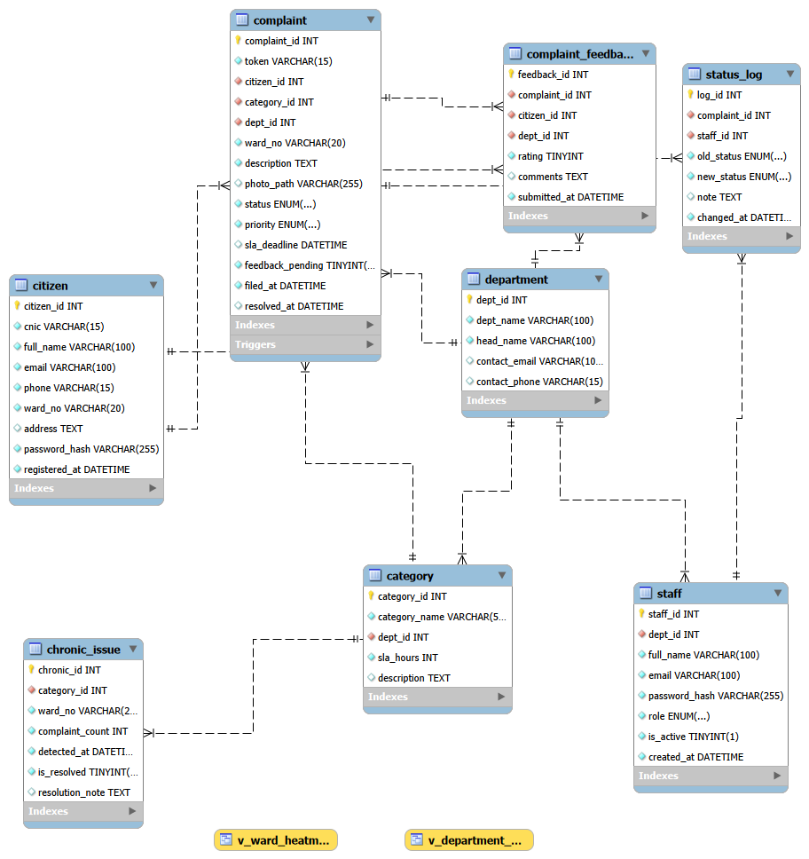

# Local Government Complaint & Public Service Request Management System

> A web-based complaint management system for local government (tehsil/municipal level). Citizens file complaints about civic issues, staff resolves them, and admins monitor performance through automated analytics.

---

## Group Information

| Field | Details |
|---|---|
| **Group Members** | Omer Zia - [umarzia-git](https://github.com/umarzia-git) &nbsp;|&nbsp; Yahya Usman - [yahya-github](https://github.com/yahyausman) |
| **Program & Group** | BSCS - Group A |
| **Institution** | IMSciences |
| **Course** | Database Systems Lab - Semester Project |

---

## Project Overview

Citizens report civic issues (water supply, road damage, electricity, sanitation) through this system. Staff members resolve assigned complaints, and admins track department-level KPIs and recurring problem areas through automated views and triggers.

**Type:** Web-based system  
**Database:** MySQL 8.0  
**ERD Tool:** MySQL Workbench  
**Data Generation:** Python (Faker library)

---

## ERD



> Initial ERD: `ERD/ERD Diagram.png` | Final normalized ERD: `ERD/ERD2.png`

---

## Repository Structure

```
DBLab_Project/
│
├── ERD/
│   ├── erd_v1.png                  ← Initial ERD (Milestone 1)
│   └── erd_updated.png             ← Updated ERD after normalization (Milestone 2)
│
├── Normalization/
│   └── NORMALIZATION.md            ← 1NF → 2NF → 3NF with justifications
│
├── Dataflow/
│   └── dataflow.md                 ← How data enters, moves, and exits the system
│
├── CSV/
│   ├── department.csv              ← 4 rows
│   ├── category.csv                ← 8 rows
│   ├── citizen.csv                 ← 80 rows
│   ├── staff.csv                   ← 20 rows
│   ├── complaint.csv               ← 100 rows
│   ├── status_log.csv              ← 150 rows
│   ├── complaint_feedback.csv      ← ~50 rows
│   └── chronic_issue.csv           ← 20 rows
│
├── SQL/
│   ├── ddl.sql                     ← CREATE TABLE + indexes + triggers + views
│   ├── dml.sql                     ← INSERT + UPDATE + DELETE statements
│   └── validation_queries.sql      ← COUNT, NULL check, FK integrity, JOINs
│
├── Docs/
│   └── Final_PDF.pdf               ← Compiled submission PDF
│
└── README.md
```

---

## Database Schema - 8 Tables

| Table | Rows | Description |
|---|---|---|
| `department` | 4 | Government departments |
| `category` | 8 | Complaint types mapped to departments |
| `citizen` | 80 | Registered citizens |
| `staff` | 20 | Department employees |
| `complaint` | 100 | Core complaint records |
| `status_log` | 150 | Audit trail of every status change |
| `complaint_feedback` | ~50 | Citizen ratings after resolution |
| `chronic_issue` | 20 | Auto-detected recurring problem areas |

---

## How to Run

**Step 1 - Create the database and tables:**
```sql
source SQL/ddl.sql
```

**Step 2 - Insert sample data:**
```sql
source SQL/dml.sql
```

**Step 3 - Run validation queries:**
```sql
source SQL/validation_queries.sql
```

> All scripts are designed to run in sequence. `ddl.sql` drops and recreates the database automatically.

---

## Innovation Features

### Innovation 1 - Ward Risk Heatmap
A SQL view (`v_ward_heatmap`) computes a weighted risk score per ward based on open complaints, SLA breaches, and citizen satisfaction. Helps admins identify high-risk areas at a glance.

### Innovation 2 - Auto-Escalation Trigger
`trg_detect_recurring` fires on every complaint INSERT. If 3 or more same-category complaints appear in the same ward within 7 days, the system automatically creates a `chronic_issue` record to flag the recurring problem.

### Innovation 3 - Citizen KPI Feedback Loop
`trg_feedback_on_resolve` fires when a complaint status changes to Resolved. It sets `feedback_pending = 1` so the citizen is prompted to submit a rating. Ratings are aggregated in `v_department_kpi` view for admin reporting.

---

## Technology Stack

| Tool | Purpose |
|---|---|
| MySQL 8.0 | Primary database |
| MySQL Workbench | ERD design and schema visualization |
| Python (Faker) | Synthetic data generation |
| Git + GitHub | Version control and collaboration |

---

## Milestones

| Milestone | Description |
|---|---|
| M1 | Initial ERD and schema designed |
| M2 | Applied 1NF–3NF normalization, updated ERD and schema |
| M3 | Synthetic data generated; dataflow documented |
| M4 | DDL scripts added, EER diagram verified |
| M5 | Data populated, validation queries added |
